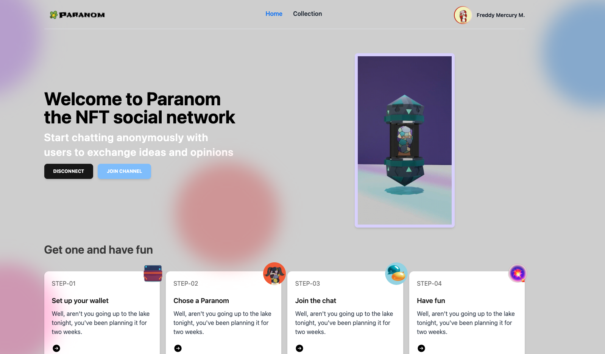
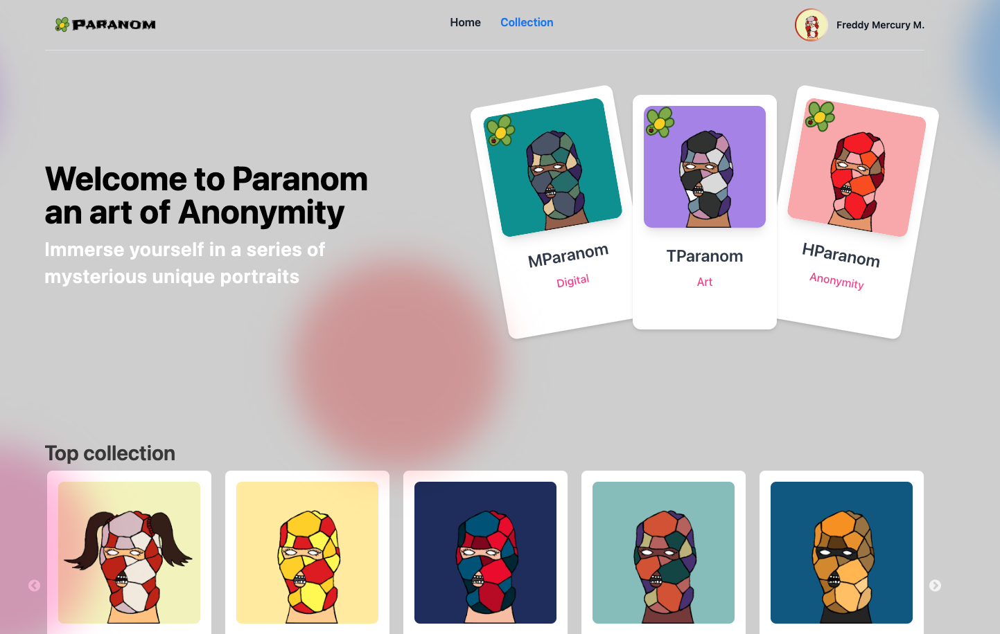
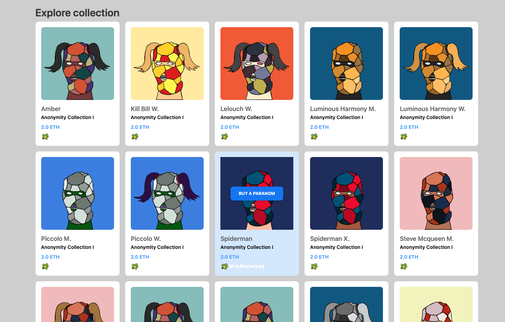
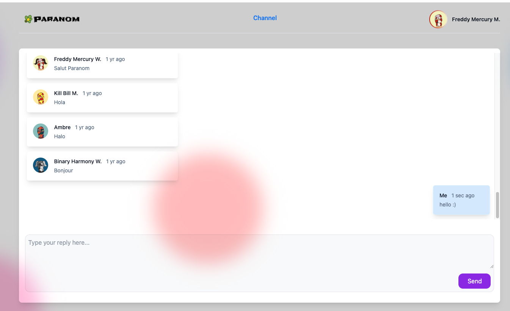
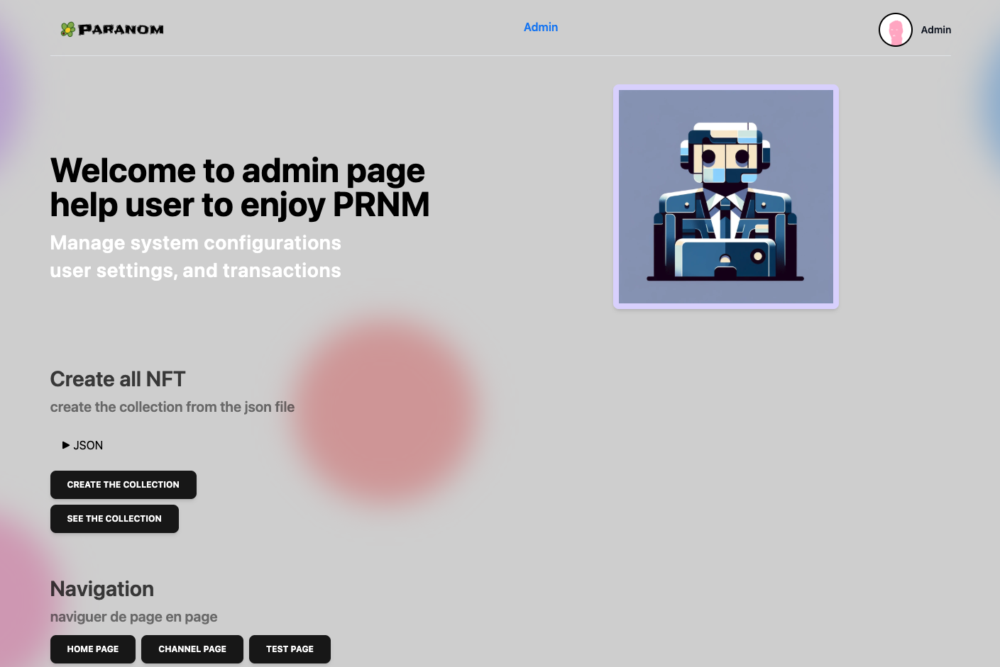
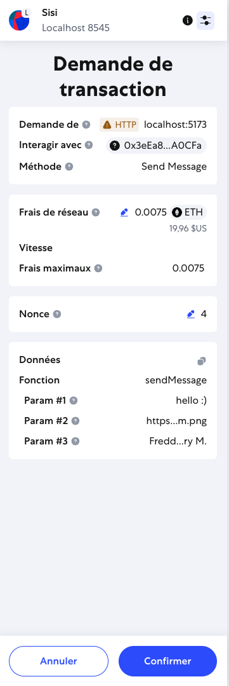
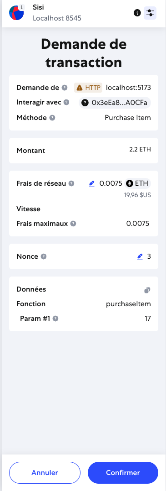

# Paranom - Decentralized NFT Marketplace

**Paranom** is my first decentralized application (dApp) project, developed in mid-2023 as an exploration into Web3 technologies. This project combines an NFT marketplace with an exclusive messaging system, where NFT owners gain access to a private decentralized channel.

## 🌟 Overview

Paranom represents my journey into blockchain development and demonstrates my first steps with Web3 technologies. Developed in collaboration with talented designers, this project was a learning experience that helped me understand the fundamentals of smart contract development, decentralized applications, and blockchain interactions.

### Key Features

- **🏪 NFT Marketplace**: Buy, sell, and discover unique digital collectibles
- **💬 Exclusive Messaging**: NFT owners get access to private decentralized channels
- **👤 Profile Management**: Customize your profile with your owned NFTs
- **⚡ Smart Contract Automation**: Fully decentralized transaction management
- **🎨 Admin Minting Interface**: Dedicated interface for NFT creation and minting
- **🔒 Local Development**: Built and tested on Ganache local blockchain

## 🚀 Technologies Used

This project was my first experience with modern Web3 technologies:

- **Solidity**: Smart contract development (first time learning!)
- **Truffle**: Development framework and testing
- **OpenZeppelin**: Security-audited contract libraries
- **Ganache**: Local blockchain for development and testing
- **Web3.js**: Blockchain interaction
- **IPFS**: Decentralized storage for NFT metadata

## 📁 Project Structure

```
paranom/
├── client-web3/               # Smart contracts & blockchain logic
├── client/                  # React.js frontend application
└── README.md                  # Project documentation
```

## 🎯 Core Functionality

### Marketplace Features
- **List NFTs**: Sellers can list their NFTs with custom pricing
- **Purchase NFTs**: Secure buying process with automatic fee distribution
- **Ownership Tracking**: Real-time ownership and transaction history

### Messaging System
- **Exclusive Access**: Only NFT owners can join the channel
- **Decentralized Messages**: Messages stored on-chain
- **User Profiles**: Custom profile pictures and names
- **Message History**: Personal and global message retrieval

### Profile Management
- **NFT Profiles**: Set any owned NFT as your profile picture
- **Collection Display**: View all owned NFTs in one place
- **Automatic Setup**: First NFT purchase automatically sets profile

## 📸 Screenshots

### Home Page


### Marketplace Interface


### Collection 


### Messaging System


### Admin NFT Creation Interface


### Transactions
<p align="center">
  
  
</p>
